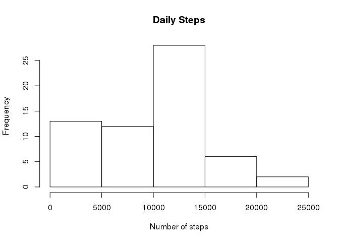
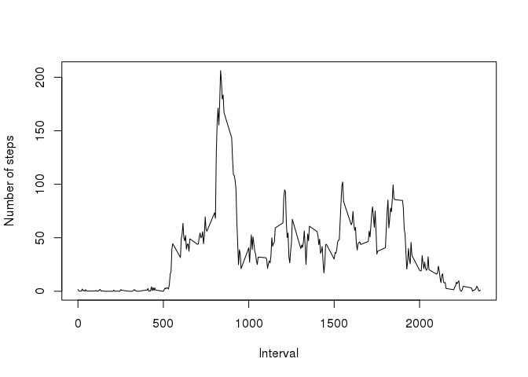
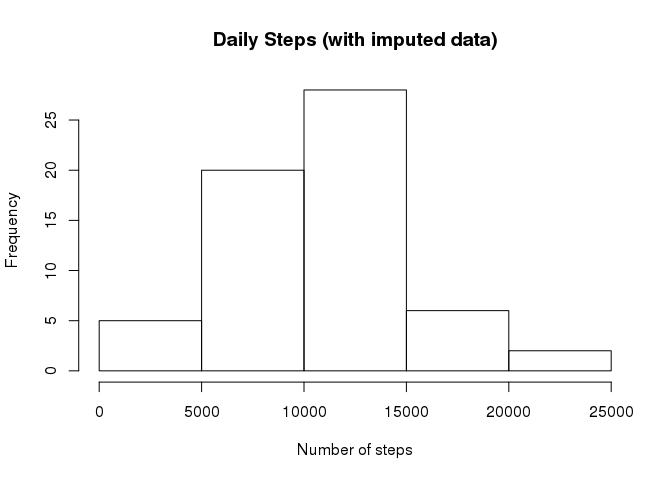
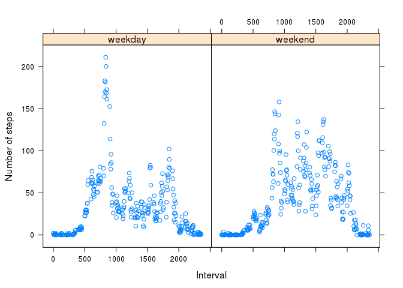

# Reproducible Research: Course Project 1

## Loading and preprocessing the data
Load the data:

```r
unzip("activity.zip")
activity <- read.csv("activity.csv")
file.remove("activity.csv")
```

```
## [1] TRUE
```

Process/transform the data into a format suitable for your analysis:

```r
activity$date <- as.Date(activity$date, format = "%Y-%m-%d")
```


## What is mean total number of steps taken per day?
Make a histogram of the total number of steps taken each day:

```r
daily.steps <- aggregate(activity$steps, by=list(activity$date), FUN=sum, na.rm=TRUE)
colnames(daily.steps) <- c("date", "steps")
hist(daily.steps$steps, main="Daily Steps", xlab="Number of steps")
```

\

Calculate and report the **mean** and **median** total number of steps taken per day

```r
mean(daily.steps$steps)
```

```
## [1] 9354.23
```

```r
median(daily.steps$steps)
```

```
## [1] 10395
```


## What is the average daily activity pattern?
Make a time series plot (i.e. `type = "l"`) of the 5-minute interval (x-axis) and the average number of steps taken, averaged across all days (y-axis)

```r
daily.activity <- aggregate(activity$steps, by=list(activity$interval), FUN=mean, na.rm=TRUE)
colnames(daily.activity) = c("interval", "steps")
plot(daily.activity$interval, daily.activity$steps, type = "l", xlab="Interval", ylab="Number of steps")
```

\

Which 5-minute interval, on average across all the days in the dataset, contains the maximum number of steps?

```r
daily.activity$interval[which.max(daily.activity$steps)]
```

```
## [1] 835
```


## Imputing missing values
Calculate and report the total number of missing values in the dataset (i.e. the 
total number of rows with `NA`s)

```r
nrow(activity) - sum(complete.cases(activity))
```

```
## [1] 2304
```

We fill in all of the missing values in the dataset by using the mean for that 
5-minute interval.

```r
getAvgStepsForInterval <- function(interval) {
    avg = daily.activity[(interval / 5) + 1, 2]
    ifelse(is.na(avg), 0, avg)
}
```

Create a new dataset that is equal to the original dataset but with the missing data filled in.

```r
complete.activity <- activity
complete.activity$steps <- ifelse(is.na(activity$steps), getAvgStepsForInterval(activity$interval), activity$steps)
```

Make a histogram of the total number of steps taken each day and Calculate and report the **mean** and **median** total number of steps taken per day. 

```r
complete.daily.steps <- aggregate(complete.activity$steps, by=list(complete.activity$date), FUN=sum)
colnames(complete.daily.steps) <- c("date", "steps")
hist(complete.daily.steps$steps, main="Daily Steps (with imputed data)", xlab="Number of steps")
```

\

```r
mean(complete.daily.steps$steps)
```

```
## [1] 10282.14
```

```r
median(complete.daily.steps$steps)
```

```
## [1] 10395
```
The mean is greater with the imputed data; the median remains the same. 


## Are there differences in activity patterns between weekdays and weekends?
Create a new factor variable in the dataset with two levels - "weekday" and "weekend" indicating whether a given date is a weekday or weekend day.

```r
getDayType <- function(date) {
    ifelse(weekdays(date) %in% c("Saturday", "Sunday"), "weekend", "weekday")
}

complete.activity$day.type <- factor(getDayType(complete.activity$date))
complete.daily.activity <- aggregate(complete.activity$steps, by=list(complete.activity$interval, complete.activity$day.type), FUN=mean)
colnames(complete.daily.activity) = c("interval", "day.type", "steps")
```

Make a panel plot containing a time series plot (i.e. `type = "l"`) of the 5-minute interval (x-axis) and the average number of steps taken, averaged across all weekday days or weekend days (y-axis). 

```r
library(lattice) 
with(complete.daily.activity, xyplot(steps ~ interval | day.type, ylab="Number of steps", xlab="Interval"), 
        layout=c(2,1), type = "l")
```

\

